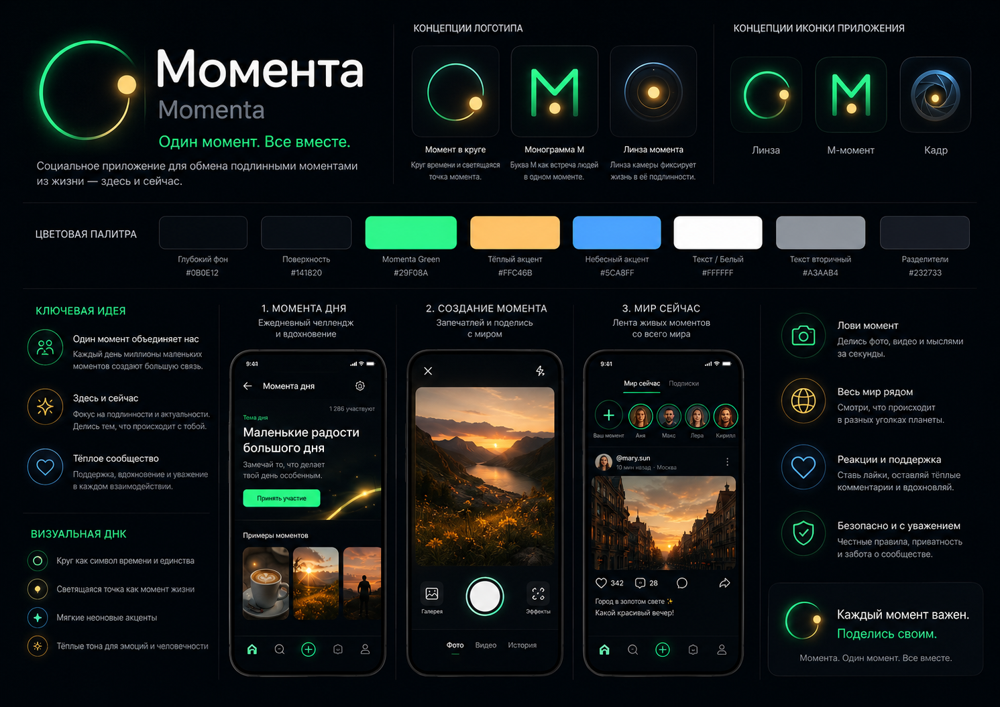

# Android UI Concept

Momenta Android follows **Momenta Design Concept v1**.

Visual reference:

## Product Feeling

The app should look like a camera-first social product:

- premium dark UI;
- neon green primary action;
- warm yellow "moment" dot;
- circular time/camera metaphor;
- large capture/publish actions;
- soft rounded cards;
- short Russian copy.

## Main Flow

Open app → see "Момента дня" → capture photo/video → preview → publish → watch "Мир сейчас".

## Current MVP Scope

Implemented in the current Android UI pass:

- dark-first theme and palette;
- Canvas Momenta logo mark/wordmark;
- branded loading state;
- four-item bottom navigation;
- redesigned Splash, Onboarding, Auth, Today, Camera, Publish, Success, Feed, Profile and Settings surfaces;
- visual reference added to `docs/design/momenta_visual_concept.png`.

Still intentionally light in MVP:

- no TikTok-style vertical pager;
- video/history tabs are visual placeholders until the feature is ready;
- full localization cleanup can continue incrementally.
